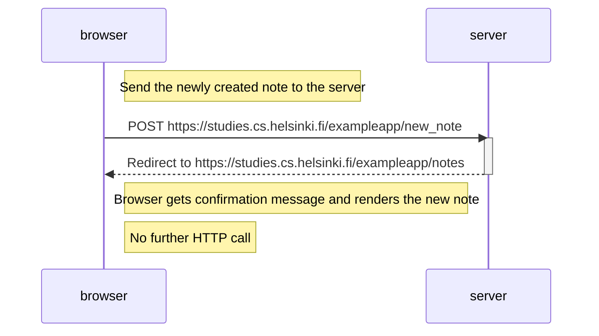

```mermaid
sequenceDiagram
    participant browser
    participant server

    Note right of browser: Send the newly created note to the server
    browser->>server: POST https://studies.cs.helsinki.fi/exampleapp/new_note
    activate server
    server-->>browser: Redirect to https://studies.cs.helsinki.fi/exampleapp/notes
    deactivate server
     Note right of browser: Browser gets confirmation message and renders the new note
    Note right of browser: No further HTTP call
```
